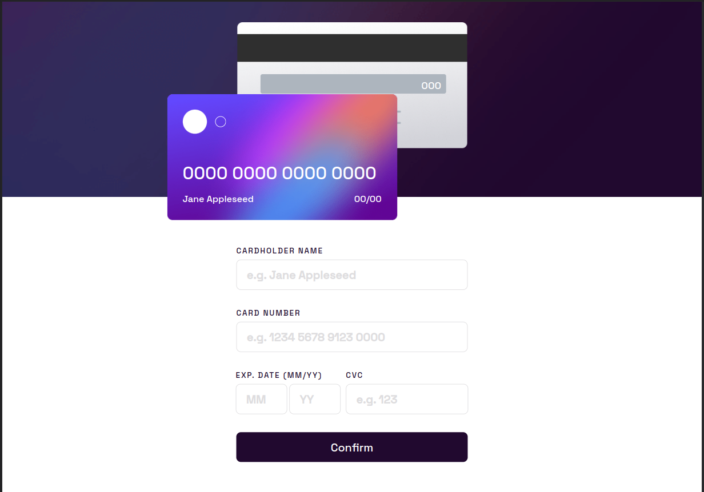
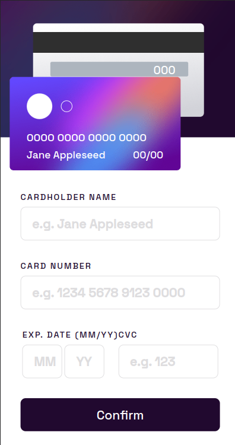
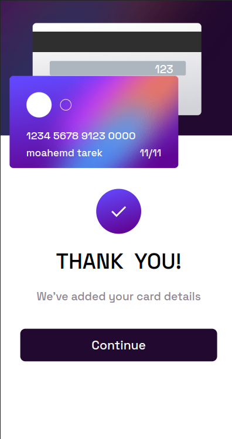

<h1>Interactive Card Details</h1>

<h2>Hi everyone!</h2>

<h3>I recently worked on an interactive card details project using HTML, CSS, and JavaScript with the DOM. The project involved creating a card that displays an image, title, description, and button. What makes this project special is that the content on the card changes dynamically when you type in an input field.</h3>

<h3>To achieve this, I used JavaScript to add an event listener to the input field. When the user types in the input field, the content on the card changes dynamically using JavaScript to manipulate the DOM elements.</h3>

<h3>Overall, this was a fun and challenging project that helped me to learn more about how HTML, CSS, and JavaScript work together to create engaging and interactive web experiences.
</h3>

<h3>Live Demo: https://mohamed-0-turki.github.io/Interactive_Card_Details/</h3>

<h4>Project design</h3>

